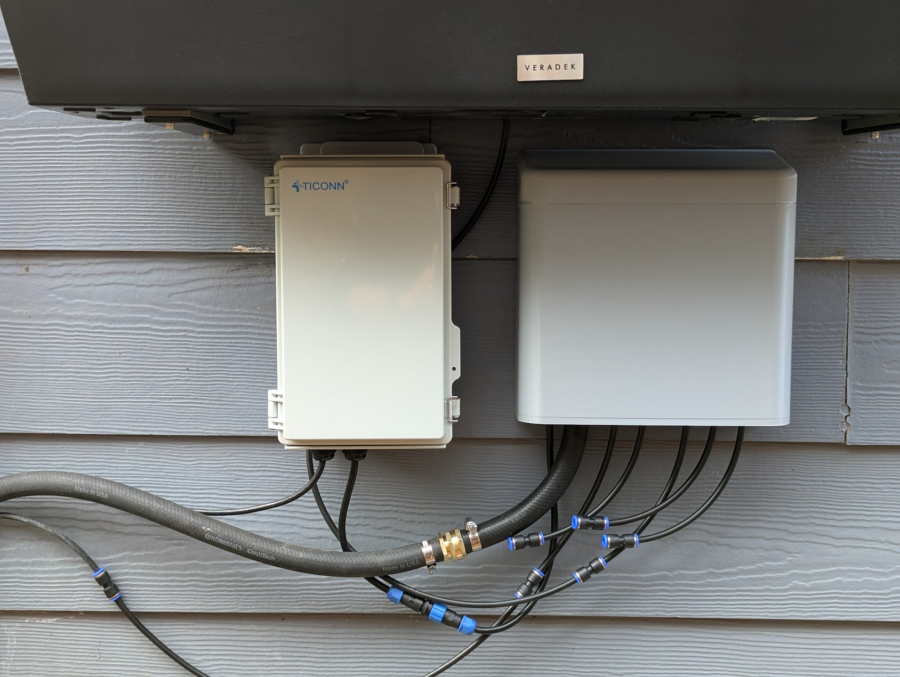
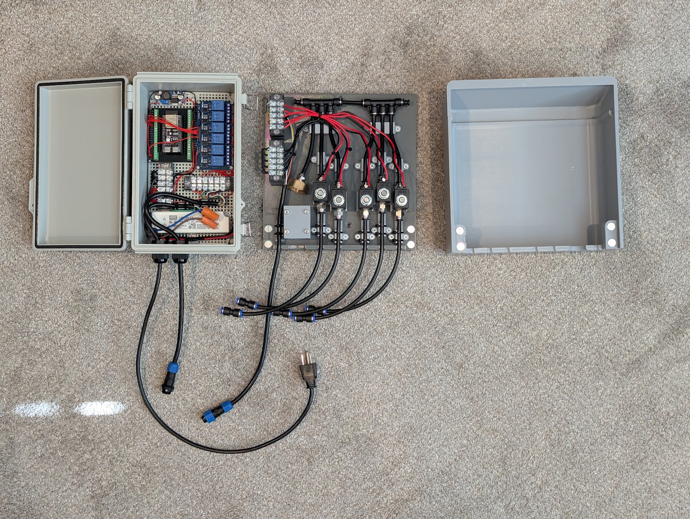

# Irrigation Control





ESP32-S3 based irrigation controller with a mobile-friendly web UI. Controls up to 5 zones via relay board, enforces single-zone water pressure constraint via a FIFO queue, and runs two daily watering programs (Morning / Afternoon).

## Hardware

| Component     | Detail                                                 |
| ------------- | ------------------------------------------------------ |
| MCU           | ESP32-S3-DevKitC-1-N8                                  |
| Status LED    | WS2812 on GPIO 48 (onboard)                            |
| Relay outputs | GPIO 4, 5, 6, 7, 15 (active-low)                       |
| Relay board   | 5-channel optocoupler relay, 12 V coils, 5 V logic VCC |

### LED status colors

- Green — standby, WiFi connected
- Blue — zone actively watering
- Off — booting / no WiFi

**Wiring note:** Use 5 V for relay board VCC (not 3.3 V). Disconnect USB-C before powering relays from 12 V supply.

**Plumbing note:** Apply Teflon tape to all NPT threaded fittings before installing into solenoid valves. Finger-tight connections will leak.

**Electronics enclosure note:** The TICONN box is waterproof and airtight, protecting all electronics from the elements. It hangs on a hook and connects via the AC cord and the 6-pin waterproof quick-disconnect, making it removable in seconds — if you need to bring it inside to update firmware, unplug both connections and take it in. Use the right USB-C port to flash code with no button pressing required.

**Valve enclosure note:** All valve housing connectors exit as quick-disconnects outside the housing. If you need to remove the enclosure for service, everything unplugs cleanly without disturbing the internal wiring.

## Parts List

Prices are approximate and subject to change.

### Electronics

| Part               | Description                            | ~Price | Link                                                                             |
| ------------------ | -------------------------------------- | ------ | -------------------------------------------------------------------------------- |
| ESP32-S3 dev board | ESP32-S3-WROOM-1, 2-pack               | ~$16   | [Amazon B0FF3XC4RZ](https://www.amazon.com/dp/B0FF3XC4RZ)                           |
| 5-ch relay board   | 5V optocoupler relay, 12 V coils       | ~$5    | [AliExpress](https://www.aliexpress.us/w/wholesale-5v-relay-board-optocoupler.html) |
| Buck converter     | 12 V → 5 V step-down (powers ESP32)   | ~$3    | [AliExpress](https://www.aliexpress.us/w/wholesale-step-down-buck.html)             |
| 12 V power supply  | Powers relay coils and solenoid valves | ~$13   | [Amazon B00MEKJ4E2](https://www.amazon.com/dp/B00MEKJ4E2)                           |

### Enclosure & Wiring

| Part                 | Description                                                                              | ~Price | Link                                                   |
| -------------------- | ---------------------------------------------------------------------------------------- | ------ | ------------------------------------------------------ |
| Waterproof enclosure | TICONN IP67 ABS box, 10.2″ × 6.3″ × 3.9″, hinged lid, cable glands                  | ~$24   | [Amazon B0BND8Y3QN](https://www.amazon.com/dp/B0BND8Y3QN) |
| Terminal blocks      | 12-pc screw terminal strip set, 600 V / 15 A                                             | ~$10   | [Amazon B09QHSLJJ3](https://www.amazon.com/dp/B09QHSLJJ3) |
| 6-conductor wire     | RESHAKE 22 AWG 6C tinned copper stranded wire, 16.4 ft — zone wiring between enclosures | ~$12   | [Amazon B0C7MKBFNK](https://www.amazon.com/dp/B0C7MKBFNK) |
| Waterproof connector | HangTon SD13 6-pin IP68 male/female plug set — inter-enclosure quick-disconnect         | ~$12   | [Amazon B0894SSPVX](https://www.amazon.com/dp/B0894SSPVX) |

### Plumbing

System uses 1/4″ OD push-to-connect tubing throughout. One solenoid valve per zone.

| Part                   | Description                                                             | ~Price    | Link                                                   |
| ---------------------- | ----------------------------------------------------------------------- | --------- | ------------------------------------------------------ |
| Solenoid valve         | 12 V DC NC, 1/4″ NPT — one per zone                                   | ~$13 each | [Amazon B07N2LGFYS](https://www.amazon.com/dp/B07N2LGFYS) |
| Hose bib adapter       | HOMENOTE 3/4″ female hose thread → 1/4″ tubing, 2-pack               | ~$9       | [Amazon B089ZZPXLQ](https://www.amazon.com/dp/B089ZZPXLQ) |
| Fittings kit           | TAILONZ 40-pc 1/4″ OD assortment — tees, elbows, straights, splitters | ~$14      | [Amazon B07RSLDDBR](https://www.amazon.com/dp/B07RSLDDBR) |
| Straight connectors    | TAILONZ 1/4″ OD push-to-connect, 5-pack                                | ~$9       | [Amazon B07SXRL8YR](https://www.amazon.com/dp/B07SXRL8YR) |
| NPT male fittings      | TAILONZ 1/4″ OD × 1/4″ NPT male straight, 10-pack                    | ~$11      | [Amazon B07PBPB367](https://www.amazon.com/dp/B07PBPB367) |
| Elbow + straight combo | TAILONZ 1/4″ OD elbow + straight NPT, 12-pack                          | ~$12      | [Amazon B088NMKHQ5](https://www.amazon.com/dp/B088NMKHQ5) |
| Ball valves            | 1/4″ OD push-to-connect PVC ball valve, 5-pack                         | ~$10      | [Amazon B09N726LFW](https://www.amazon.com/dp/B09N726LFW) |

## 3D Printed Parts

The solenoid valve enclosure consists of two pieces, a base and a cover. Both consist of two parts due to my MK4s bed size. Used PETG for both as ASA warped too much to produce reliable, dimensionally accurate parts. I used Overture Space Gray PETG. The cover uses 12 mm rare earth magnets to secure when closed. Super glue holds the magnets in their holes.

The valve assembly parts are intentionally designed as separate, individually replaceable pieces.

| Part              | Perimeters | Infill |
| ----------------- | ---------- | ------ |
| Cover             | 3          | 15%    |
| Base (×2 halves) | 4          | 35%    |
| Everything else   | 2          | 15%    |

### Assembly

1. **Base halves** — lightly tap the two halves together with a hammer until seated, then apply super glue along the seam to join permanently.
2. **Hardware mounting** — use wood screws to mount all hardware. 5/8″ screws work well for most mounting points.

## Software

- Framework: Arduino via PlatformIO
- Async HTTP server (ESPAsyncWebServer)
- Config persisted in NVS (ESP32 Preferences) — nonvolatile memory that survives firmware upgrades, so your zone names, schedules, and settings are safe when you flash new code
- Embedded single-file HTML/CSS/JS UI served from PROGMEM

### Resource usage (current build)

|       | Used   | Available | %   |
| ----- | ------ | --------- | --- |
| RAM   | 55 KB  | 320 KB    | 17% |
| Flash | 822 KB | 3,264 KB  | 25% |

## Setup

1. Install [PlatformIO](https://platformio.org/).
2. Copy `src/secrets.h.example` to `src/secrets.h` and fill in your WiFi credentials:

   ```cpp
   const char* WIFI_SSID = "your_ssid";
   const char* WIFI_PASS = "your_password";
   ```
3. Connect the ESP32-S3 via the **right USB-C port** (labeled USB on the board). This port uses native USB and handles bootloader mode automatically — no button pressing required for uploads or reboots. The left port (UART) requires holding BOOT then pressing RESET to enter download mode.
4. Build and upload:

   ```text
   pio run --target upload
   ```
5. Open a browser to the ESP32's IP address (printed on serial at 115200 baud).

## Web UI

The web UI runs directly on the ESP32 — no app, no cloud, no external server. Open a browser on any device on the same network and you're in. If your router supports VPN (such as WireGuard or OpenVPN), you can VPN into your home network from anywhere and access the controller as if you were home.

- **Zones** — collapsible cards showing zone name, status badge, and Run Now button. Expand to set per-program durations and rename the zone.
- **Programs** — Morning and Afternoon schedules. Set time and days of week; changes save automatically on input. Enable/disable per program.
- **Run Now** — modal with 1 min / 10 min quick-select buttons or a custom duration entry. Queues the zone at the front of the run order. All other Run Now buttons disable while a zone is running or queued.
- **All Off** — stops the active zone and clears the queue.
- **Run Log** — button between Programs and the info bar; opens a modal showing watering history grouped by day and program, newest first.
- **Chip temperature** — live ESP32 die temperature displayed in the bottom bar. Click to open a temperature history graph with **1 Day** (last 24 h) and **1 Week** (last 7 days) toggle buttons. Defaults to day view on open. Auto-refreshes every 60 seconds while open; switching views triggers a new fetch. The device records a sample every 10 minutes (up to 1 008 samples in RAM, reset on reboot).
- **Uptime** — time since last boot, displayed in the bottom bar and updated every 15 seconds.
- **Theme** — 🎨 icon in the top bar cycles dark → light → color on each tap. Preference saved in localStorage.

## API Endpoints

All endpoints are HTTP GET.

| Endpoint         | Params                                       | Description                                                                                                                      |
| ---------------- | -------------------------------------------- | -------------------------------------------------------------------------------------------------------------------------------- |
| `/config`      | —                                           | JSON snapshot of full state (zones, programs, active zone, queue, epoch, time zone offset, uptime seconds)                       |
| `/relay`       | `id`, `state` (0/1), `mins` (optional) | Turn a zone on (queued) or off                                                                                                   |
| `/alloff`      | —                                           | Stop active zone, clear queue                                                                                                    |
| `/setzone`     | `id`, `name`, `pin`, `d0`…`dN`    | Update zone name, GPIO pin, or per-program durations (minutes)                                                                   |
| `/setprogram`  | `id`, `en`, `h`, `m`, `days`       | Update a watering program                                                                                                        |
| `/history`     | —                                           | JSON run history (newest first), includes `retainDays` and `count`                                                           |
| `/sethistory`  | `days`                                     | Set history retention window (1–90 days)                                                                                        |
| `/temp`        | —                                           | Current chip die temperature as `{"c": 52.3, "f": 126.1}`                                                                      |
| `/temphistory` | `secs` (optional, default 604800)          | JSON array of temperature samples (10-min intervals) covering the requested window — up to 144 for 24 h, up to 1 008 for 7 days |

### `/history` response example

```json
{
  "retainDays": 7,
  "count": 3,
  "history": [
    {
      "zone": 2,
      "name": "Back Garden",
      "trigger": "Morning",
      "start": 1746000000,
      "durationSecs": 300
    }
  ]
}
```

### `/temphistory` response example

```json
[
  {"t": 1746000000, "f": 124.3},
  {"t": 1746000600, "f": 125.1}
]
```

## Scheduling

A single water pressure source means one relay runs at a time. The scheduler uses a FIFO queue:

- When a program fires it enqueues all enabled zones back-to-back.
- A manual Run Now enqueues that zone at the head of the queue.
- Turning a zone off removes it from the queue and stops it if active.

Run history lives in a 200-entry circular RAM buffer and purges to the configured retention window on boot and after each run.

## File Structure

```text
irrigation_control/
├── platformio.ini
├── src/
│   ├── main.cpp          # All firmware + embedded HTML UI
│   ├── secrets.h         # WiFi credentials (gitignored)
│   └── secrets.h.example
└── README.md
```
