# Irrigation Control

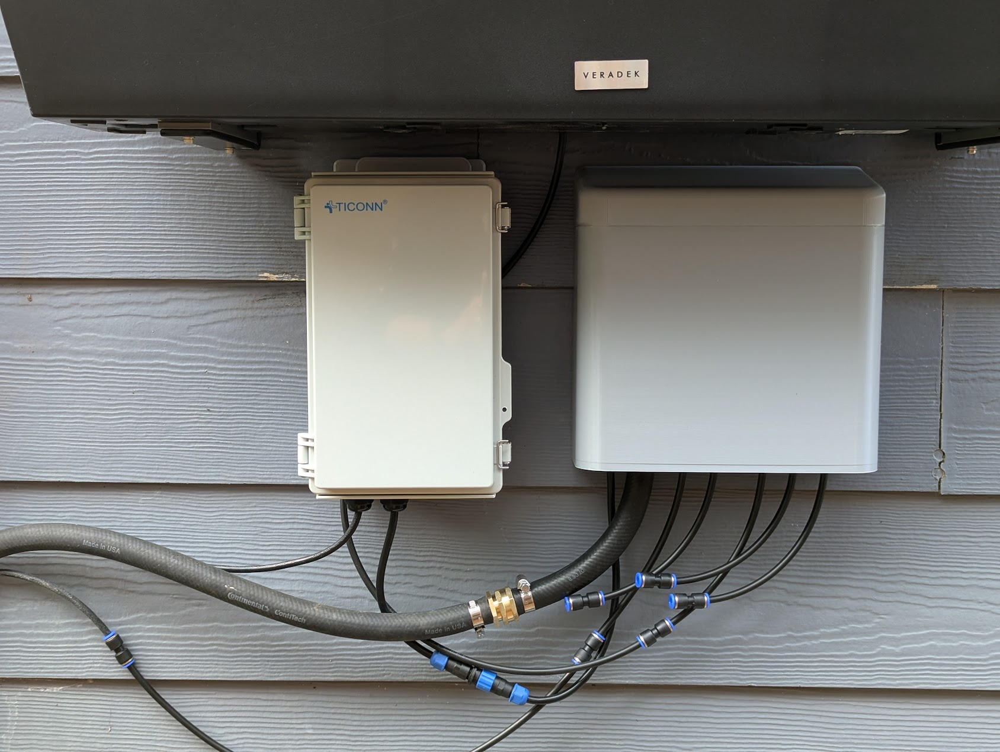

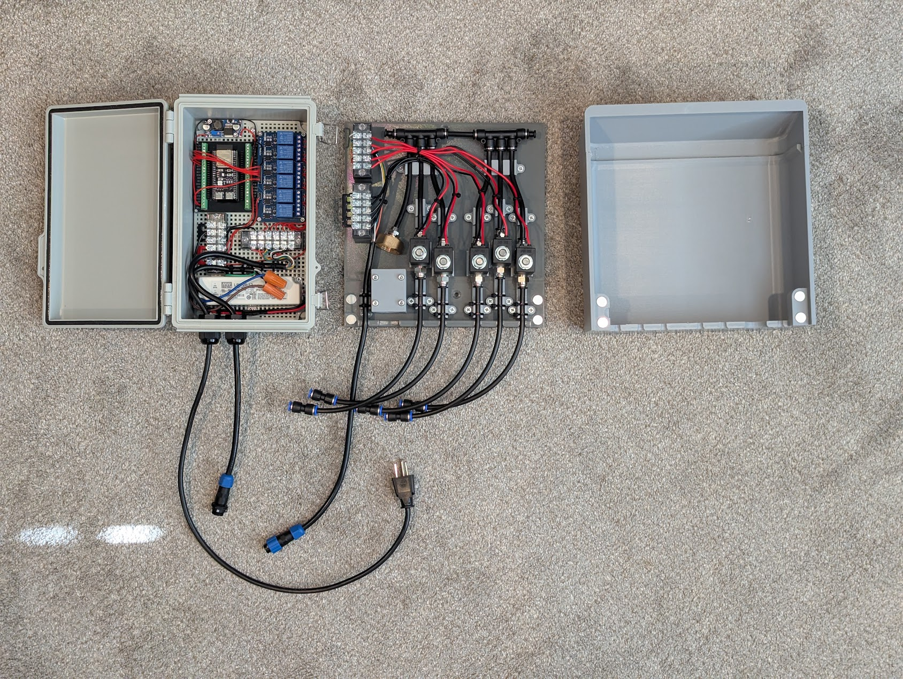

ESP32-S3 based irrigation controller with a mobile-friendly web UI. Controls up to 5 zones via relay board, enforces single-zone water pressure constraint via a FIFO queue, and runs two daily watering programs (Morning / Afternoon).

## Hardware

| Component     | Detail                                                       |
| ------------- | ------------------------------------------------------------ |
| MCU           | ESP32-S3-DevKitC-1-N8                                        |
| Status LED    | WS2812 on GPIO 48 (onboard)                                  |
| Relay outputs | GPIO 4, 5, 6, 7, 15 (active-low)                             |
| Relay board   | 5-channel optocoupler relay, 12 V coils, 5 V logic VCC       |
| Flow sensor   | DIGITEN FL-S402B on GPIO 16 — Red→3.3 V, Black→GND, Yellow→GPIO 16 |

### LED status colors

- Green — standby, WiFi connected
- Blue — zone actively watering
- Off — booting / no WiFi

**Wiring note:** Use 5 V for relay board VCC (not 3.3 V). Disconnect USB-C before powering relays from 12 V supply.

**Plumbing note:** Apply Teflon tape to all NPT threaded fittings before installing into solenoid valves. Finger-tight connections will leak.

**Electronics enclosure note:** The TICONN box is waterproof and airtight, protecting all electronics from the elements. It hangs on a hook and connects via the AC cord and the 6-pin waterproof quick-disconnect, making it removable in seconds — if you need to bring it inside to update firmware, unplug both connections and take it in. Use the right USB-C port to flash code with no button pressing required.

**Valve enclosure note:** All valve housing connectors exit as quick-disconnects outside the housing. If you need to remove the enclosure for service, everything unplugs cleanly without disturbing the internal wiring.

**Chip temperature note:** On hot days the on-chip die temperature can read around 160 °F (71 °C). This is well within the ESP32-S3's maximum junction temperature spec of 125 °C (257 °F). At first glance 160 °F looks alarming, but it is normal and consistent with what other ESP32 users report when running inside an airtight enclosure exposed to direct sun.

## Parts List

Prices are approximate and subject to change.

### Electronics

| Image                                                                                 | Part               | Description                                                                  | ~Price | Link                                                                             |
| ------------------------------------------------------------------------------------- | ------------------ | ---------------------------------------------------------------------------- | ------ | -------------------------------------------------------------------------------- |
| 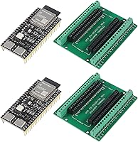               | ESP32-S3 dev board | ESP32-S3-WROOM-1, 2-pack                                                     | ~$16   | [Amazon B0FF3XC4RZ](https://www.amazon.com/dp/B0FF3XC4RZ)                           |
| 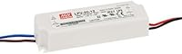               | 12 V power supply  | Powers relay coils and solenoid valves                                       | ~$13   | [Amazon B00MEKJ4E2](https://www.amazon.com/dp/B00MEKJ4E2)                           |
| 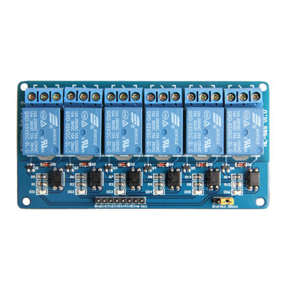           | 5-ch relay board   | 5V optocoupler relay, 12 V coils                                             | ~$5    | [AliExpress](https://www.aliexpress.us/w/wholesale-5v-relay-board-optocoupler.html) |
| 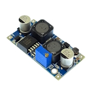          | Buck converter     | 12 V → 5 V step-down (powers ESP32)                                         | ~$3    | [AliExpress](https://www.aliexpress.us/w/wholesale-step-down-buck.html)             |
|     | Flow sensor        | DIGITEN FL-S402B, 1/4″ quick-connect, 0.3–10 L/min Hall effect — GPIO 16   | ~$9.50 | [Amazon search](https://www.amazon.com/s?k=1%2F4+Quick+Connect+0.3-10L%2Fmin+Water+Hall+Effect+Flow+Sensor+Meter) |

### Enclosure & Wiring

| Image                                                                                   | Part                 | Description                                                                              | ~Price | Link                                                   |
| --------------------------------------------------------------------------------------- | -------------------- | ---------------------------------------------------------------------------------------- | ------ | ------------------------------------------------------ |
| 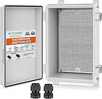            | Waterproof enclosure | TICONN IP67 ABS box, 10.2″ × 6.3″ × 3.9″, hinged lid, cable glands                  | ~$24   | [Amazon B0BND8Y3QN](https://www.amazon.com/dp/B0BND8Y3QN) |
| 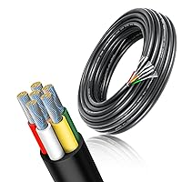                  | 6-conductor wire     | RESHAKE 22 AWG 6C tinned copper stranded wire, 16.4 ft — zone wiring between enclosures | ~$12   | [Amazon B0C7MKBFNK](https://www.amazon.com/dp/B0C7MKBFNK) |
| 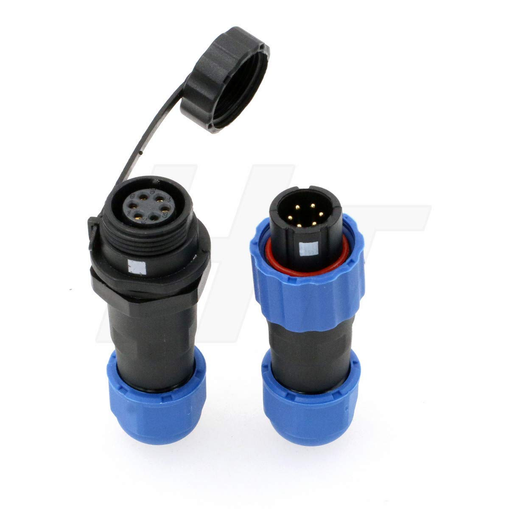 | Waterproof connector | HangTon SD13 6-pin IP68 male/female plug set — inter-enclosure quick-disconnect         | ~$12   | [Amazon B0894SSPVX](https://www.amazon.com/dp/B0894SSPVX) |
| 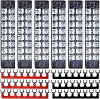           | Terminal blocks      | 12-pc screw terminal strip set, 600 V / 15 A                                             | ~$10   | [Amazon B09QHSLJJ3](https://www.amazon.com/dp/B09QHSLJJ3) |

### Plumbing

System uses 1/4″ OD push-to-connect tubing throughout. One solenoid valve per zone.

| Image                                                                                 | Part                | Description                                                                                  | ~Price     | Link                                                   |
| ------------------------------------------------------------------------------------- | ------------------- | -------------------------------------------------------------------------------------------- | ---------- | ------------------------------------------------------ |
| 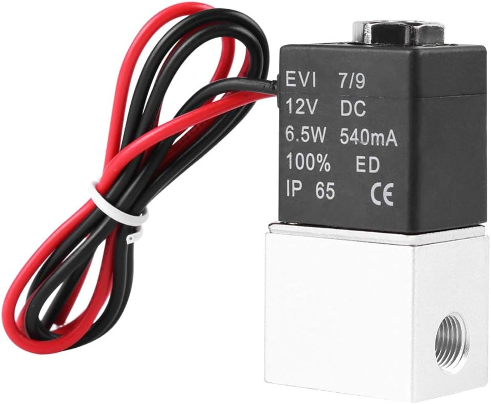           | Solenoid valve      | 12 V DC NC, 1/4″ NPT — one per zone                                                        | ~$10 each | [Amazon B07N2LGFYS](https://www.amazon.com/dp/B07N2LGFYS) |
| 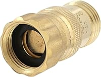   | Pressure regulator  | 25 psi, 3/4″ hose thread, lead-free brass — protects drip system                           | ~$13       | [Amazon B0B1M42TVG](https://www.amazon.com/dp/B0B1M42TVG) |
| 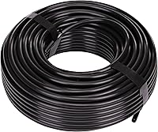             | Supply tubing       | Raindrip 1/4″ OD black poly, 100 ft — smooth outer layer for push-to-connect compatibility | ~$10       | [Amazon B0007WJIJU](https://www.amazon.com/dp/B0007WJIJU) |
| 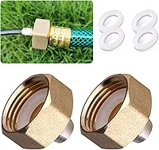       | Hose bib adapter    | HOMENOTE 3/4″ female hose thread → 1/4″ tubing, 2-pack                                    | ~$9        | [Amazon B089ZZPXLQ](https://www.amazon.com/dp/B089ZZPXLQ) |
| 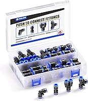               | Fittings kit        | TAILONZ 40-pc 1/4″ OD assortment — tees, elbows, straights, splitters                      | ~$14       | [Amazon B07RSLDDBR](https://www.amazon.com/dp/B07RSLDDBR) |
| 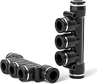 | Straight connectors | TAILONZ 1/4″ OD push-to-connect, 5-pack                                                     | ~$9        | [Amazon B07SXRL8YR](https://www.amazon.com/dp/B07SXRL8YR) |
| 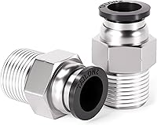          | NPT male fittings   | TAILONZ 1/4″ OD × 1/4″ NPT male straight, 10-pack                                         | ~$11       | [Amazon B07PBPB367](https://www.amazon.com/dp/B07PBPB367) |
|                  | Teflon tape         | PTFE thread seal tape, 1/2″ wide, 4-pack — for all NPT fittings                            | ~$5        | [Amazon B091913Z7F](https://www.amazon.com/dp/B091913Z7F) |

## 3D Printed Parts

The solenoid valve enclosure consists of two pieces, a base and a cover. Both consist of two parts due to my MK4s bed size. Used PETG for both as ASA warped too much to produce reliable, dimensionally accurate parts. I used Overture Space Gray PETG. The cover uses 12 mm rare earth magnets to secure when closed. Super glue holds the magnets in their holes.

The valve assembly parts are intentionally designed as separate, individually replaceable pieces.

The parts are segmented to fit the MK4s print bed. If you have a larger-format printer, open the STEP file (`stl/1_4_drip_irrigation_valve_housing.step`) in your CAD program to merge the halves into single pieces and clean up the seams. Always room for improvement — adapt it to your setup and submit a PR.

| Part              | Perimeters | Infill |
| ----------------- | ---------- | ------ |
| Cover             | 3          | 15%    |
| Base (×2 halves) | 4          | 35%    |
| Everything else   | 2          | 15%    |

### Assembly

1. **Base halves** — lightly tap the two halves together with a hammer until seated, then apply super glue along the seam to join permanently.
2. **Hardware mounting** — use wood screws to mount all hardware. 5/8″ screws work well for most mounting points.

## Commissioning Notes

### NPT fitting leaks

When I first pressurized the system I found leaks at three of the ten NPT fittings. Fix: depressurize the system, remove all five solenoids, and apply two full wraps of Teflon tape to every NPT fitting before reinstalling. Do them all at once rather than chasing leaks one at a time.

### Solenoid valve body leak

If water drips from the black valve body itself (not from a fitting), the internal o-ring needs reseating. To service:

1. Depressurize the system.
2. Remove the retaining nut — hand-tight, as it holds the solenoid coil on the cylinder but creates no seal. No torque needed.
3. Remove the solenoid coil.
4. Remove the two screws securing the end plate and pull the plate off.
5. Pull the cylinder out of the valve body.
6. Apply a thin coat of Super Lube synthetic silicone grease to the o-ring at the base of the cylinder.
7. Press the cylinder back into the valve body. Once fully seated, rotate it left and right about 90° to help the greased o-ring seat evenly and form a good seal.
8. Reinstall the end plate with the two screws.
9. Reinstall the solenoid coil and thread the retaining nut hand-tight. The end plate and its two screws handle all sealing — the nut retains the coil, nothing more.

## Software

- Framework: Arduino via PlatformIO
- Async HTTP server (ESPAsyncWebServer)
- Config persisted in NVS (ESP32 Preferences) — nonvolatile memory that survives firmware upgrades, so your zone names, schedules, and settings are safe when you flash new code
- Run, temperature, weather and change logs persisted to LittleFS — these also survive a firmware flash
- Embedded single-file HTML/CSS/JS UI served from PROGMEM

### Resource usage (current build)

|       | Used     | Available | %   |
| ----- | -------- | --------- | --- |
| RAM   | 57 KB    | 320 KB    | 18% |
| Flash | 1,075 KB | 3,264 KB  | 33% |

## Setup

1. Install [PlatformIO](https://platformio.org/).
2. Copy `src/secrets.h.example` to `src/secrets.h` and fill in your WiFi credentials:

   ```cpp
   const char* WIFI_SSID = "your_ssid";
   const char* WIFI_PASS = "your_password";
   ```
3. Copy `src/location.h.example` to `src/location.h` and fill in your coordinates (used for weather-based watering adjustments):

   ```cpp
   #define WEATHER_LAT  45.633   // your latitude
   #define WEATHER_LON -122.490  // your longitude
   ```

   Both `secrets.h` and `location.h` are gitignored so your credentials and location stay off GitHub.

5. Connect the ESP32-S3 via the **right USB-C port** (labeled USB on the board). This port uses native USB and handles bootloader mode automatically — no button pressing required for uploads or reboots. The left port (UART) requires holding BOOT then pressing RESET to enter download mode.
6. Build and upload:

   ```text
   pio run --target upload
   ```
7. Open a browser to the ESP32's IP address (printed on serial at 115200 baud).

## Web UI

The web UI runs directly on the ESP32 — no app, no cloud, no external server. Open a browser on any device on the same network and you're in. If your router supports VPN (such as WireGuard or OpenVPN), you can VPN into your home network from anywhere and access the controller as if you were home.

### Zones

Each zone appears as a card showing its name, active status, and a **Run Now** button. When a zone has a duration configured for a program, a colored pill label shows the program name and duration at a glance. Below the pill labels, a row of day buttons shows which days that zone participates in that program — blue for Morning, violet for Afternoon. Day buttons are read-only when collapsed.

> 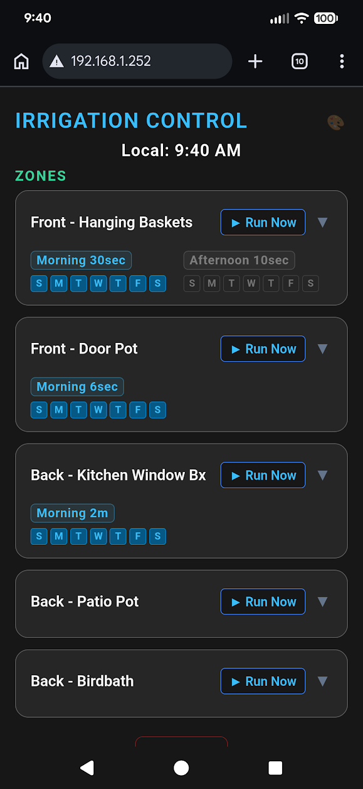

At the right-hand end of the day-button row, a **power switch** parks the zone for
the season. Switched off, the zone is skipped by both scheduled runs and program
**Run Now**, but its durations and day masks are kept exactly as they were — so the
timings you dialled in over the summer are still there next spring. A parked zone
renders greyed out. A single-zone **Run Now** still works as an explicit manual
override, so you can always test a parked zone.

Tap the arrow to expand a zone. The day buttons become interactive so you can toggle individual days per program. The duration inputs let you set minutes and seconds independently for Morning and Afternoon.

> 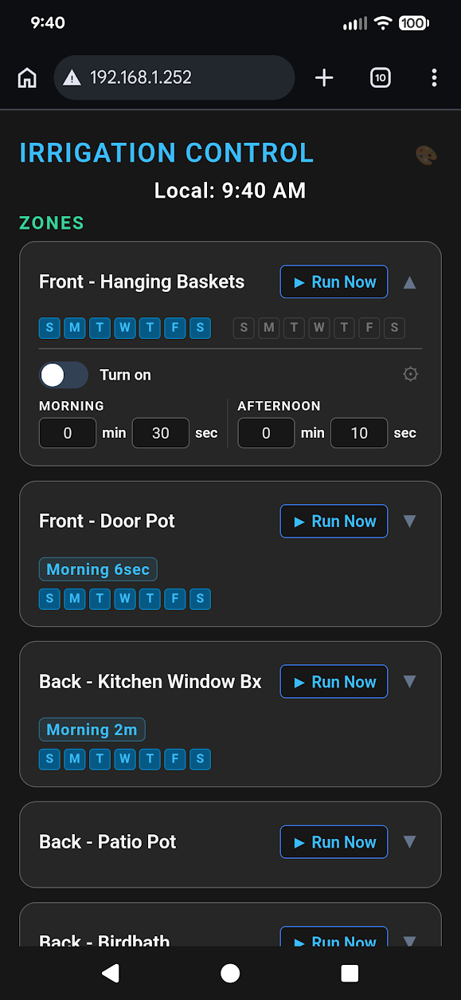

Tap the gear icon inside an expanded zone to open the configuration panel where you can rename the zone and change its GPIO pin.

> 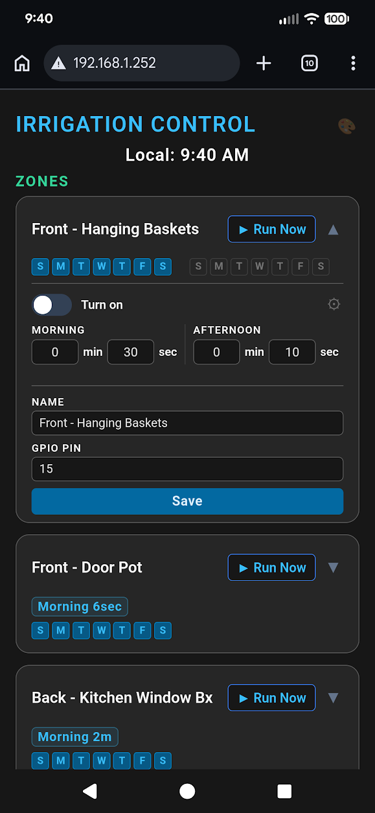

### Run Now

Tap **Run Now** on any zone to open the run dialog. It offers that zone's configured
Morning and Afternoon durations as one-tap presets — colour-matched to the schedule
pills — or tap **Custom** to dial in an exact duration.

> 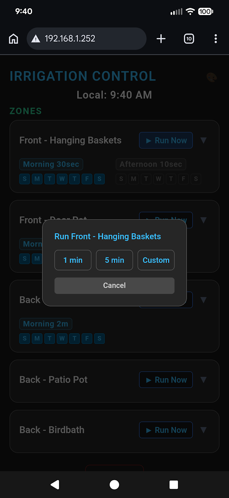

> 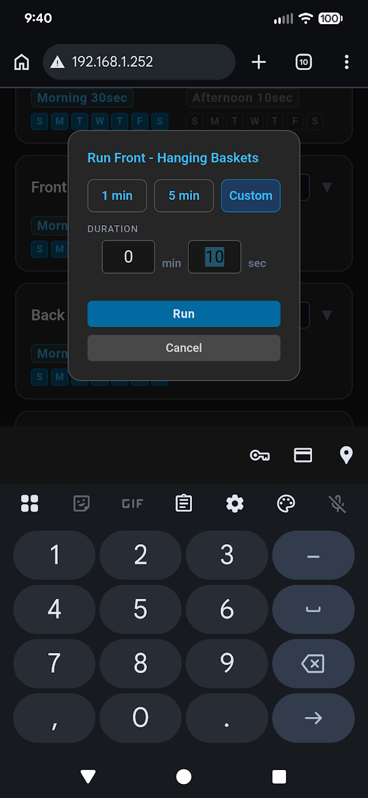

The zone is queued immediately. All other Run Now buttons disable while any zone is running or queued to prevent pressure conflicts. Use **All Off** to stop the active zone and clear the queue instantly.

### Programs

Two watering programs — Morning and Afternoon — each have an independent time, day-of-week mask, and enable toggle. Changes save to flash automatically when you interact with any control.

> 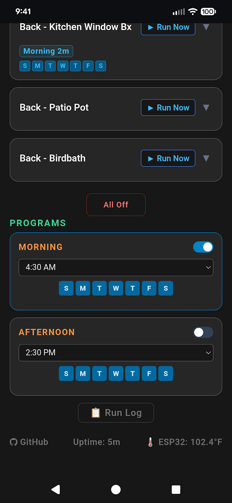

Each zone independently opts in or out of a program on a per-day basis using the day toggles on the zone card. A zone only waters when **both** the program's day mask **and** the zone's own day mask include that day of the week. This lets you run some zones every day while others water only on certain days, all within the same program schedule.

### Flow Monitoring

The flow sensor measures actual water delivered per zone run, auditing for upstream pressure problems (failing pressure regulator, supply starvation) and per-zone issues (clogged drip emitters, broken lines).

#### Wiring

Install the sensor inline on the main supply line — upstream of the solenoid valves so all zones flow through it.

| Wire   | Connect to      |
| ------ | --------------- |
| Red    | 3.3 V           |
| Black  | GND             |
| Yellow | GPIO 16 (signal)|

**Sensor spec (DIGITEN FL-S402B):** F = 23 × Q(L/min) — approximately 1,380 pulses/liter or **~5,220 pulses/gallon** theoretical. Always run the in-app calibration for your specific installation; actual values vary with pressure and fittings.

#### Calibration

1. Wire the sensor and flash firmware with flow sensor support enabled.
2. Open the web UI and tap **Flow Cal** (to the right of the weather badge).
3. Select the zone to run during calibration (defaults to Zone 5). Choose a zone that flows through the sensor.
4. Verify **Flow Sensor GPIO Pin** is set to **16**.
5. Have a clean 1-gallon measuring jug ready at the zone outlet.
6. Tap **▶ Start Cal** — the selected zone turns on and pulse counting begins.
7. Allow water to flow until the jug reaches exactly **1 gallon**, then tap **■ Stop Cal**.
8. The zone stops and the counted pulses auto-populate the **Pulses per Gallon** field. Review and adjust if needed.
9. Set your **Low-flow alarm threshold** (default 75% — alarm triggers when a run delivers less than 75% of the baseline flow rate).
10. Tap **Save**.

#### Baseline learning and low-flow alarms

After calibration, the firmware auto-learns a per-zone flow baseline from the first 3 valid runs (runs ≥ 30 seconds with measured flow). Progress is shown in the Flow Cal modal next to each zone name.

Once a baseline is established for a zone:

- If a run's flow rate drops **below the alarm threshold** (default 75% of baseline), a persistent red banner appears at the top of the page on the next visit: **"Low flow detected: Zone X — possible upstream pressure issue or clogged emitters. Check run logs."**
- The banner is dismissible for the current session, but reappears on the next page load until the alarm clears.
- When subsequent runs return to within spec, the alarm **clears automatically**.
- To reset a zone's baseline (e.g., after intentionally changing emitters), open **Flow Cal**, select the zone, and tap **Reset Baseline for Selected Zone**.

The **Flow Adjustment row** below the weather badge shows today's and this week's total gallons delivered across all zones, along with the active GPIO pin and pulses/gallon setting. It is hidden until the sensor is calibrated.

The **Run Log** shows a blue gallon figure (e.g., `2.4g`) next to each run's duration once flow data is available. The CSV export includes a **Water (gal)** column.

### Additional features

- **All Off** — stops the active zone and clears the entire queue.
- **Run countdown** — the active zone's badge counts down the time remaining, ticking every second between the 15-second state polls.
- **Run Log** — opens a modal showing watering history grouped by day and program, newest first. Includes per-run gallon measurements once the flow sensor is calibrated.
- **Chip temperature** — live ESP32 die temperature in the bottom bar. Tap to open a history graph with **1 Day** and **1 Week** views. Auto-refreshes every 60 seconds while open. Samples recorded every 10 minutes (up to 1,008, persisted to LittleFS so they survive a reboot).
- **Uptime** — time since last boot, updated every 15 seconds.
- **Theme** — 🎨 icon cycles dark → light → color. Preference saved in localStorage.

## API Endpoints

**Read-only endpoints are `GET`. Every state-changing endpoint is `POST`.** A `GET`
against a `POST` endpoint returns 404. This keeps a stray ``
on some other page — or a link prefetcher, or a crawler — from actuating a valve.
Parameters still travel in the query string either way, so `POST /relay?id=0&state=1`
needs no request body.

### Read (GET)

| Endpoint         | Params                              | Description                                                                                       |
| ---------------- | ----------------------------------- | ------------------------------------------------------------------------------------------------- |
| `/`              | —                                   | The web UI, with the current state inlined so the first paint needs no round trip                 |
| `/config`        | —                                   | JSON snapshot of full state — see fields below                                                    |
| `/history`       | —                                   | Run history, newest first; includes `retainDays` and `count`                                      |
| `/changelog`     | —                                   | Configuration change log, up to 50 entries                                                        |
| `/weatherlog`    | —                                   | Last 7 weather fetches, newest first, successes and failures                                      |
| `/temp`          | —                                   | Current chip die temperature as `{"c": 52.3, "f": 126.1}`                                         |
| `/temphistory`   | `secs` (default 604800)             | Temperature samples at 10-min intervals — up to 144 for 24 h, up to 1008 for 7 days               |
| `/flowcal/stop`  | —                                   | Returns `{"pulses": N}` — the value to use as pulses/gallon. Reads the counter; does not stop it  |

### Write (POST)

| Endpoint              | Params                                        | Description                                                                             |
| --------------------- | --------------------------------------------- | ----------------------------------------------------------------------------------------- |
| `/relay`              | `id`, `state` (0/1), `secs` (optional)        | Queue a zone, or stop it and drop it from the queue. `secs`, not minutes                |
| `/alloff`             | —                                             | Stop the active zone and clear the queue                                                |
| `/runprogram`         | `id`                                          | Queue a program's zones immediately, skipping switched-off zones                        |
| `/setzone`            | `id`, `name`, `pin`, `en`, `d0`…`dN`, `zd0`…`zdN` | Zone name, GPIO pin, power switch, per-program durations **in seconds**, per-program day masks |
| `/setprogram`         | `id`, `en`, `h`, `m`, `days`                  | Program enable, time and day mask (bit 0 = Sunday)                                      |
| `/sethistory`         | `days`                                        | Run-history retention window, 1–90 days                                                 |
| `/setcoolpct`         | `pct`                                         | Cool-day watering percentage, 10–90                                                     |
| `/sethotpct`          | `pct`                                         | Hot-day watering percentage, 100–200                                                    |
| `/setweatherconds`    | `htf`, `hwk`, `hof`, `ctf`, `ccp`, `cpx`      | Hot/cool thresholds: temp °F, wind kph, override °F, cool °F, cloud %, precip ×10 mm    |
| `/fetchweather`       | —                                             | Trigger an immediate weather fetch on the background task                               |
| `/pushcl`             | `e` (URL-encoded JSON)                        | Append a change-log entry                                                               |
| `/clearcl`            | `confirm=1`                                   | Erase the change log. Without `confirm=1` returns 400 — it is destructive                |
| `/flowcal/start`      | —                                             | Zero the pulse counter before filling the calibration jug                               |
| `/setflow`            | `pin`, `ppg`                                  | Flow sensor GPIO pin and pulses-per-gallon                                              |
| `/setflowthresh`      | `pct`                                         | Low-flow alarm threshold, 10–99; default 75                                             |
| `/dismissflowalarm`   | —                                             | Hide the current low-flow banner until a fresh alarm occurs                             |
| `/resetflowbaseline`  | `zone`                                        | Clear one zone's baseline and alarm; re-learns over the next 3 runs                     |

### `/config` fields of note

| Field          | Meaning                                                                             |
| -------------- | ------------------------------------------------------------------------------------- |
| `activeZone`   | Index of the running zone, or `-1`                                                  |
| `activeEnd`    | Unix time the active run ends, or `0` — drives the countdown on the zone badge      |
| `queued`       | Zone indices waiting, in order                                                      |
| `chipF`        | Chip die temperature in °F                                                          |
| `weatherScale` | Active watering percentage, 100 unless the day read hot or cool                     |
| `zones[].enabled` | `false` when the zone's power switch is off — durations are retained             |
| `zfBase` / `zfCnt` | Per-zone flow baseline (gal/min ×100) and how many learning runs have landed    |

### `/history` response example

```json
{
  "retainDays": 7,
  "count": 3,
  "history": [
    {
      "zone": 2,
      "name": "Back Garden",
      "trigger": "Morning",
      "start": 1746000000,
      "durationSecs": 300,
      "gallonsX10": 24,
      "lowFlow": 0
    }
  ]
}
```

### `/temphistory` response example

```json
[
  {"t": 1746000000, "f": 124.3},
  {"t": 1746000600, "f": 125.1}
]
```

## Scheduling

A single water pressure source means one relay runs at a time. The scheduler uses a FIFO queue:

- When a program fires it enqueues all enabled zones back-to-back.
- A manual Run Now enqueues that zone at the head of the queue.
- Turning a zone off removes it from the queue and stops it if active.

Run history lives in a 200-entry circular buffer, mirrored to LittleFS (`hist.bin`) so
it survives a reboot, and purges to the configured retention window after each run.

Writes to flash are deferred: HTTP handlers run on the async server task, which must
not block, so they flag what changed and the main loop performs the NVS and LittleFS
writes on its next pass.

A zone waters only when its power switch is on, the program's day mask includes today,
**and** the zone's own day mask includes today.

## File Structure

```text
irrigation_control/
├── platformio.ini
├── partitions.csv            # 8 MB layout: dual OTA app slots + 1.5 MB LittleFS
├── irrigation-widget.html    # Standalone desktop widget (reads /config and /temp)
├── src/
│   ├── main.cpp              # All firmware + embedded HTML UI
│   ├── secrets.h             # WiFi credentials (gitignored)
│   ├── secrets.h.example
│   ├── location.h            # Latitude/longitude for weather (gitignored)
│   └── location.h.example
├── stl/                      # 3D-printable enclosure parts
├── pics/                     # README screenshots and BOM thumbnails
└── README.md
```

Logs are kept on the LittleFS partition as `hist.bin`, `temp.bin`, `wlog.bin` and
`clog.json`. Flashing firmware leaves them alone; writing a filesystem image with
`pio run -t uploadfs` would erase all four.
